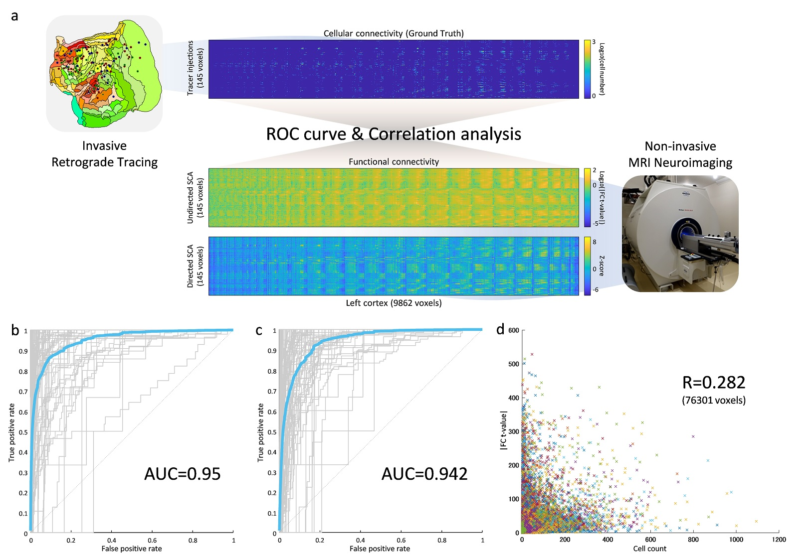
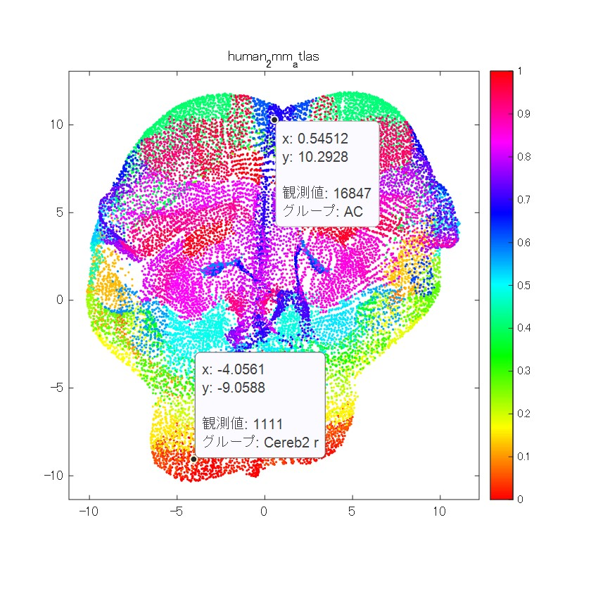

# DirSCA and FFM toolbox
Directed SCA (Seed-based connectivity analysis) and Functional flat mapping (FFM) toolbox for MATLAB

## Introduction
Estimating the direction of functional connectivity (FC) could help to further elucidate complex brain function.
We developed a novel directed seed-based connectivity analysis (SCA) method based on normalized pairwise Granger causality.
We evaluated its performance against 145 retrograde tracer injections in the left cortex of common marmoset that were used as ground truth cellular connectivity on a voxel-by-voxel basis. 
The ROC curve was calculated for each injection, and the AUC (Area Under the ROC Curve) became 0.95 for undirected and 0.942 for directed SCA in higher cell number threshold case.

Our novel directed SCA method, visualized with functional flat mapping (FFM), accurately reflects cellular connections, demonstrating a new paradigm for whole-brain functional analysis. 
 

<b>Command line tools</b>

| name | description |
|:---|:---|
| dirsca | Calculate directed and undirected Seed-based connectivity analysis. |
| flatmap | Plot functional flat mapping. |
| plotsca | Plot SCA result with background image.|

## Requirements: Software
* MATLAB R2019b or later
* Image Processing Toolbox ver11.0 or later
* Parallel Computing Toolbox ver7.1 or later
* [VARDNN Toolbox](https://github.com/takuto-okuno-riken/vardnn)

Please download the [VARDNN Toolbox](https://github.com/takuto-okuno-riken/vardnn) and "Add Path" in the MATLAB before using DirSCA and FFM Toolbox.

## Installation
1. Download this Toolbox and [VARDNN Toolbox](https://github.com/takuto-okuno-riken/vardnn) zip files.
2. Extract zip files under your working directory <work_path>.
3. Run the MATLAB software, and "Add Path" extracted directories (i.e. <work_path>/vardnn-master and <work_path>/dirsca-master).
4. Move to <work_path>/dirsca-master directory and run the following demos.

## Command Line Tools Demos
<b>Demo 1</b> 
The first demo shows functional flat mapping of a human default mode network (DMN) component calculated by group ICA. 
(Copy and paste this command line. Demo data is included in DirSCA and FFM Toolbox.)
~~~
>> flatmap data/zstat_DMN.nii.gz --cmap hot --backdot 0.1 0.1 0.1
load functional flat map definition : data/human_ffm_cubeRoi2.mat
load voxel mask : data/human_2mm_cubeRoi2.nii.gz
read NIfTI file : zstat_DMN
color range=[0 12.2829]
~~~
This demo plots functional flat mapping of the human DMN:

##
<b>Demo 2</b> 
This demo shows functional flat mapping of a Conn atlas ROIs. 
(Copy and paste this command line. Demo data is included in DirSCA and FFM Toolbox.)
~~~
>> flatmap data/human_2mm_atlas.nii.gz --cmap hsv --backgr 1 1 1 --atlasop mode --roiname data/human_atlas_roiname.mat
load functional flat map definition : data/human_ffm_cubeRoi2.mat
load voxel mask : data/human_2mm_cubeRoi2.nii.gz
load ROI name file : data/human_atlas_roiname.mat
read NIfTI file : human_2mm_atlas
color range=[0 132]
~~~
FFM dot can be selected by click and showed its ROI name. Then, you can visually confirm relation between dots and ROIs.

##
<b>Demo 3</b> 
The second demo shows performing directed (-d option) and undirected (-n option) SCA of full voxel (-f option, 4mm isotropic cube)
with pre-processed human resting state fMRI image (standard MNI space) files. 
First 10 frames are removed, gaussian kernel smoothing (FWHM=3.4 voxels each) is applied, Global Mean (GM) and aCompCor nuisance factor removal is applied for denoising process.
Parallel processing is used for the calculation with 10 working pools. 
(Caution: Data for this demo is not included in the toolbox. Please use your own pre-processed human subjects fMRI data.)
~~~
>> dirsca -d -n -f --rmframe 10 --smooth 3.4 3.4 3.4 --nui gmacomp --pool 10 human_rest_sbj1.nii.gz human_rest_sbj2.nii.gz
load SCA target voxels : data/human_2mm_cubeRoi2.nii.gz
load CSF mask : data/human_2mm_csf.nii.gz
load white matter mask : data/human_2mm_wm.nii.gz
load whole brain mask : data/human_2mm_brain_mask.nii.gz
processing : human_rest_sbj1
remove first 10 frames.
apply gaussian kernel smoothing [3.4 3.4 3.4] voxels.
apply nuisance factor removal (gmacomp)
process Mixed-Effects correlation ...
...
done t=212.2082sec
saving results/nondir-human_2mm_cubeRoi2-full-r10-s3.4-3.4-3.4-gmacomp-human_rest_sbj1.mat
process Mixed-Effects Pairwise Granger causality estimation ...
...

~~~
This demo plots second level (group level) analysis result of full voxel functional connectivity matrix (24860 x 24860):

Second level (group level) analysis result of full voxel functional connectivity matrix (24860 x 24860) is saved in "results/nondir-human_2mm_cubeRoi2-full-r10-s3.4-3.4-3.4-gmacomp-human_rest_sbj1.mat" (undirected)
and "results/dir-human_2mm_cubeRoi2-full-r10-s3.4-3.4-3.4-gmacomp-human_rest_sbj1.mat" (directed). In each mat file, "T2" matrix is undirected SCA result, and "Z2" matrix is directed SCA result. 
First level (individual level) analsys result is saved in "results/cache" directory. For example, "cache-corr-human_2mm_cubeRoi2-full-r10-s3.4-3.4-3.4-gmacomp-human_rest_sbj1-1.mat" (undirected) contains
top right matrix elements of correlation coefficients for one subject.

## Command Line Tools Reference
<b>dirsca command</b> 
~~~
>> dirsca -h
usage: dirsca [options][-d][-n][-f][-s seed.nii.gz] file1.nii.gz ...
  -d                  perform directed seed-based connectivity analysis
  -n                  perform undirected seed-based connectivity analysis
  -f, --full          full voxel connectivity analysis
  -s, --seed file     NIfTI <file> of seed ROI voxels
  --compseed          seed is 4D component file
  --atlas file        NIfTI <file> of target ROI voxels (default: data/human_2mm_cubeRoi2.nii.gz)
  --mask file         NIfTI <file> of target mask (full voxel) for seed analysis (Preferred over atlas option)
  --list file         text <file> of subject NIfTI file list
  --rmframe num       remove first <num> frames (default: 10)
  --smooth x y z      gaussian kernel smoothing FWHM=[x y z] voxels (default: off)
  --nui algo          nuisance factor removal method (default: "gmacomp")
  --compnum num       component number for aCompCor (default: 6)
  --nuibr file        brain mask NIfTI <file> for global signal of nuisance factor removal (default: data/human_2mm_brain_mask.nii.gz)
  --nuiwm file        white matter mask NIfTI <file> for wm-mean of nuisance factor removal (default: data/human_2mm_wm.nii.gz)
  --nuicsf file       csf mask NIfTI <file> for csf-mean of nuisance factor removal (default: data/human_2mm_csf.nii.gz)
  --highpass freq     high-pass NIfTI <freq> Hz (default: off)
  --lags num          spot time lag for directed SCA (default: auto)
  --rankmeth type     ranking method for directed SCA (default: "exact")
  --outpath path      output files <path> (default:"results")
  --cachepath path    cache path <path> (default:"results/cache")
  --showsig           show processed time-series of input NIfTI file
  --showras           show raster plot of processed time-series of input NIfTI file
  --nocache           do not use cache file for conversion
  --pool num          working pool number for parallel calculation
  -v, --version       show version number
  -h, --help          show command line help
~~~
The input files should be NIfTI format, or text file which includes list of NIfTI files can be specified by --list option.
Calculation result will be saved in <outpath>.

## 
<b>flatmap command</b> 
~~~
>> flatmap -h
usage: flatmap [options] file1.nii.gz ...
  --atlas file        NIfTI <file> of target ROI voxels (default: data/human_2mm_cubeRoi2.nii.gz)
  --mask file         NIfTI <file> of target mask (full voxel) (Preferred over atlas option)
  --flatmap file      functional flat map definition <file>(default: data/human_ffm_cubeRoi2.mat)
  --range min max     T-value/Z-score color range for image plot
  --cmap type         color map type for image plot (default: "hot")
  --cmap type         color map type for image plot (default: "hot")
  --backdot r g b     background dot color (default: [])
  --backgr r g b      background color (default: 0 0 0)
  -v, --version       show version number
  -h, --help          show command line help
~~~
The input files should be NIfTI format.

## Citing DirSCA and FFM toolbox
If you find DirSCA and FFM Toolbox useful in your research, please cite it as follows: 

Takuto Okuno, Junichi Hata, Hideyuki Okano, Alexander Woodward (in submission)
["A Novel Directed Seed-Based Connectivity Analysis Toolbox applied to human and marmoset resting-state fMRI"](https://www.yahoo.com/), in submission

